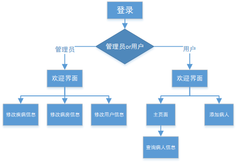
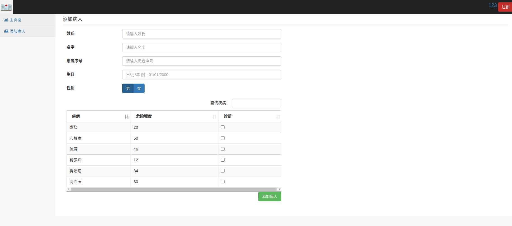
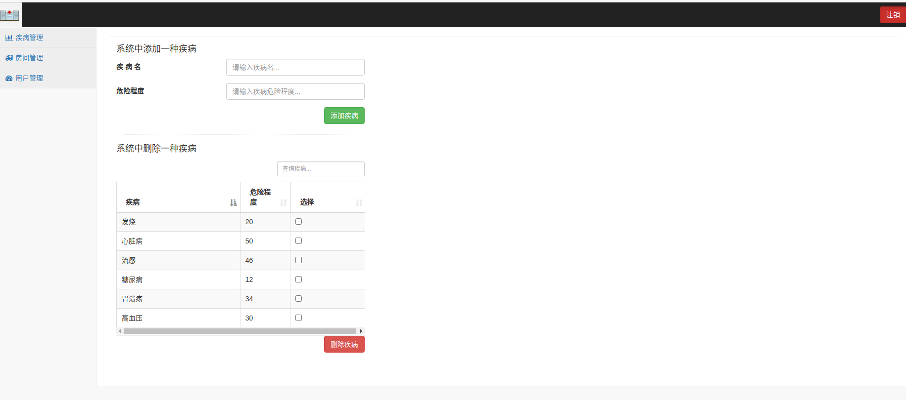
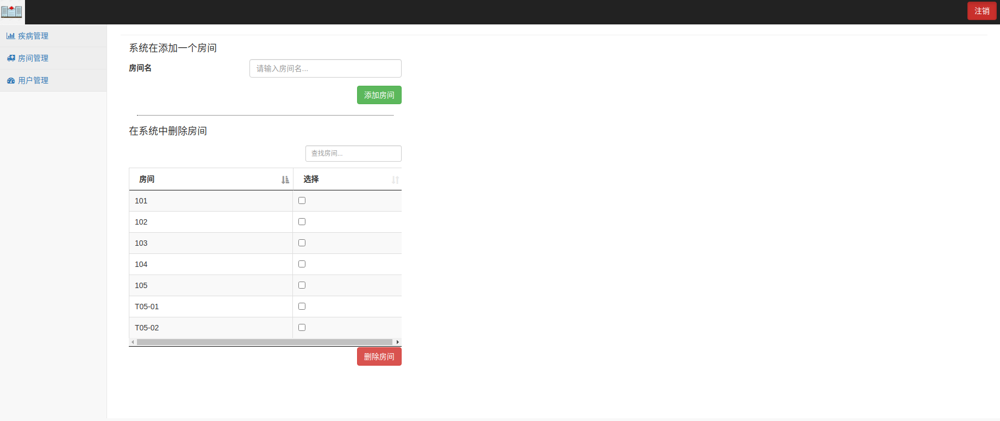
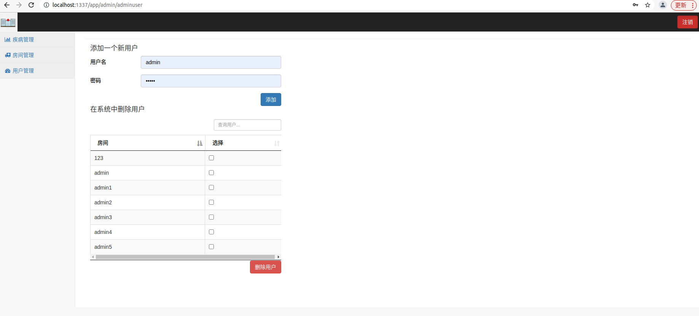
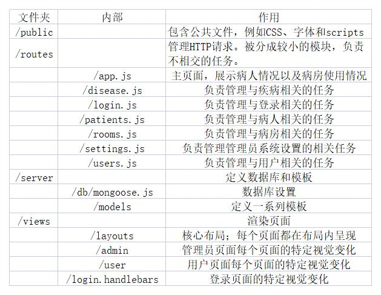

# 医院管理系统

### 1.系统简介

这是一个用于管理病房和确定患者住进病房优先级的程序。医生能够通过该系统保存诊断信息，并实时跟踪患者及其疾病，并对患者的房间进行概览。同时护士能够根据患者情况更好的管理患者之间的房间分配。

### 2.项目相关技术

​	项目中前端主要运用了Handlebars+jQuery模板引擎，它能够在加载时被预处理，保证了模板加载和运行的速度同时运用了Bootstrap框架对界面进行了美化。后端运用了express框架,数据库则为mongodb。

### 3.项目总体构成

项目首先分成管理员和普通用户两个部分。

​	1）管理员部分主要是为了配置一些基础数据：疾病类型以及对应危险程度，病房数据以及用户数据，管理元能够查看并修改这些基础数据。

​	2）普通用户能够添加病人个人信息，查看并更新病人情况，查看病房情况，以及为病人安排病房。

​	系统为医院内部使用，用户需要管理员统一管理，因此没有注册功能，只能通过管理员添加新用户，这样能够使得系统更加安全。

### 4.使用说明

##### 1）用户端

###### （1）主界面：

​		主界面中有三个表格分别显示了有病房的病人，正在等待病房的病人和空闲病房。第前两个表格中显示了用户的序号姓名和病情的危险程度，不同的危险程度会显示不同的颜色，当危险程度小于5时为白色，大于5小于20时为黄色，大于20小于40时为橙色，而大于40时为红色。并且可以注意到在一些病人的姓名前有个红色标识。这说明病人已超过24小时为检查，需要点击用户并进行病情更新就可以消除。

我们能够通过双击病人名字查看病人的具体信息以及病情，并对病情进行一个新的诊断。在这里我们还可以通过点击等待区的病人再点击对应的病房或者先点击病房在点击病人就能将病人安排到对应的房间。

###### 	（2）添加新病人

用户填写病人相关个人信息以及病情诊断，然后点击添加病人就将病人信息加入了系统。

##### 2）管理员端

###### 	(1)疾病管理

在这个页面管理员能够添加或者删除疾病。

###### 	（2）房间管理

在这个页面管理员能够添加或者删除房间。

###### 	（3）用户管理

在这个页面管理员能够添加或者删除用户。

### 5.项目目录结构

### 6.数据库设计

​	数据集 User：存储用户账号密码

|      *User*      |
| :--------------: |
| username：用户名 |
|  password：密码  |

​	数据集 Patient：存储病人的相关信息

|        *Patient*         |
| :----------------------: |
|      firstName：姓       |
|       lastName：名       |
|    dataOfBirth：生日     |
|        sex：性别         |
|   hospitalNumber：序号   |
|     diseases：疾病名     |
|       room：病房号       |
| lastUpdate：上次诊断日期 |

​	数据集Disease：存储所有疾病的信息，通过“name”与数据集Patient连接

|       Disease       |
| :-----------------: |
|    name：疾病名     |
| score：疾病危险程度 |

​	数据集Room：存储所有病房的信息，通过“name”与数据集Patient连接

|            Room            |
| :------------------------: |
|        name：病房名        |
| availability：病房占用情况 |

### 开发日记

**老师很抱歉，我在最后一次提交的时候本地文件出现了损坏，我一直修复不了，所以我直接覆盖了github上之前的文件，之前的commit也都消失了。**

浏览网上信息疫情下医院病房资源缺乏，于是想到了病房管理这个idea，于是通过查询资料建立了一个网页，将初级登录以及添加用户系统建立，再通过设置病房管理以及疾病管理系统，完成了基础数据的添加和修改。然后完善界面界面布局便得到了一个初步的系统。然后将系统设置部分从用户界面移除，添加管理员界面将系统设置移动到这里，将用户系统界面和管理员系统界面分开就获得了最后的项目。
